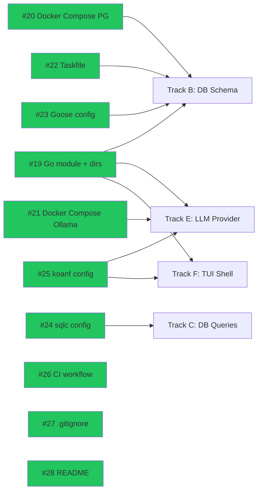
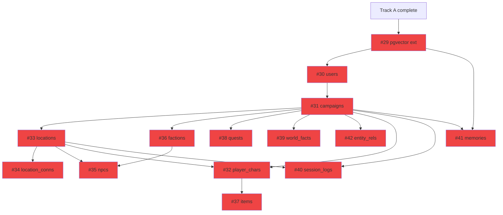
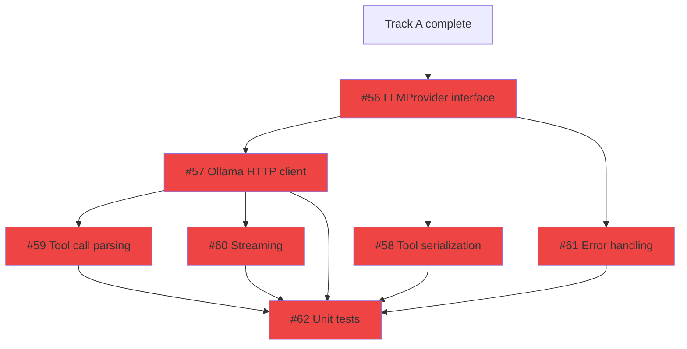
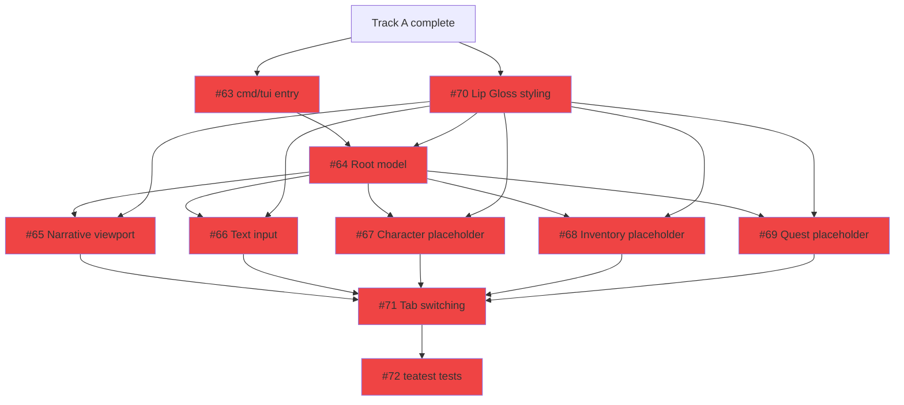

# Phase 1: Foundation & Infrastructure

> 54 issues across 6 tracks. **10 ready now**, 44 blocked by dependencies.
> Updated: 2026-03-21

## Summary

| Track | Name             | Total  | Ready  | Blocked | Epic | Models              |
| ----- | ---------------- | :----: | :----: | :-----: | ---- | ------------------- |
| A     | Project Scaffold |   10   |   10   |    0    | #2   | gpt-5.4 mini / Codex |
| B     | Database Schema  |   14   |   0    |   14    | #3   | gpt-5.3-codex       |
| C     | Database Queries |   12   |   0    |   12    | #3   | gpt-5.3-codex       |
| D     | Database Tests   |   1    |   0    |    1    | #3   | Claude Sonnet 4.6   |
| E     | LLM Provider     |   7    |   0    |    7    | #4   | Mixed               |
| F     | TUI Shell        |   10   |   0    |   10    | #5   | Mixed               |
|       | **Total**        | **54** | **10** | **44**  |      |                     |

**Critical path:** Track A → Tracks B, E, F (parallel) → Track C → Track D

**Phase exit criteria:** All 54 issues closed. Postgres+pgvector running, sqlc generating code, LLM provider making calls, TUI shell booting with view switching, CI green.

---
<!--
## Track A: Project Scaffold

> Foundation for everything. All issues are independent and parallelizable.
> Depends on: Nothing

| #   | Issue                                                          | Title                                         | Size | Blocker | Status | Model         | Notes                                   |
| --- | -------------------------------------------------------------- | --------------------------------------------- | :--: | ------- | ------ | ------------- | --------------------------------------- |
| 1   | [#19](https://git.subcult.tv/subculture-collective/edda/issues/19) | Initialize Go module and directory structure  |  S   | None    | READY  | gpt-5.4 mini  | Do first — everything imports from this |
| 2   | [#20](https://git.subcult.tv/subculture-collective/edda/issues/20) | Create Docker Compose: Postgres with pgvector |  S   | None    | READY  | gpt-5.4 mini  |                                         |
| 3   | [#21](https://git.subcult.tv/subculture-collective/edda/issues/21) | Add Ollama service to Docker Compose          |  XS  | None    | READY  | gpt-5.4 mini  |                                         |
| 4   | [#22](https://git.subcult.tv/subculture-collective/edda/issues/22) | Create Taskfile with core tasks               |  S   | None    | READY  | gpt-5.4 mini  |                                         |
| 5   | [#23](https://git.subcult.tv/subculture-collective/edda/issues/23) | Configure goose for database migrations       |  S   | None    | READY  | gpt-5.4 mini  |                                         |
| 6   | [#24](https://git.subcult.tv/subculture-collective/edda/issues/24) | Configure sqlc for code generation            |  S   | None    | READY  | gpt-5.4 mini  |                                         |
| 7   | [#25](https://git.subcult.tv/subculture-collective/edda/issues/25) | Set up koanf configuration loading            |  M   | None    | READY  | gpt-5.3-codex |                                         |
| 8   | [#26](https://git.subcult.tv/subculture-collective/edda/issues/26) | Create GitHub Actions CI workflow             |  M   | None    | READY  | gpt-5.4 mini  |                                         |
| 9   | [#27](https://git.subcult.tv/subculture-collective/edda/issues/27) | Create .gitignore and .env.example            |  XS  | None    | READY  | Claude Haiku 4.5 |                                      |
| 10  | [#28](https://git.subcult.tv/subculture-collective/edda/issues/28) | Create README with setup instructions         |  S   | None    | READY  | Claude Sonnet 4.6 |                                    |
-->

<!--
**Parallelizable:** All 10 issues can run simultaneously. Prioritize #19 (everything depends on it).

---

## Track B: Database Schema (Migrations)

> All table migrations. Must run after Track A scaffold is in place.
> Depends on: Track A (#19 go module, #20 Docker Compose, #23 goose)

| #   | Issue                                                          | Title                                        | Size | Blocker  | Status  | Model         | Notes                     |
| --- | -------------------------------------------------------------- | -------------------------------------------- | :--: | -------- | ------- | ------------- | ------------------------- |
| 1   | [#29](https://git.subcult.tv/subculture-collective/edda/issues/29) | Migration: enable pgvector extension         |  XS  | Track A  | BLOCKED | gpt-5.3-codex | Must be first migration   |
| 2   | [#30](https://git.subcult.tv/subculture-collective/edda/issues/30) | Migration: create users table                |  XS  | #29      | BLOCKED | gpt-5.3-codex |                           |
| 3   | [#31](https://git.subcult.tv/subculture-collective/edda/issues/31) | Migration: create campaigns table            |  XS  | #30      | BLOCKED | gpt-5.3-codex | FK → users                |
| 4   | [#33](https://git.subcult.tv/subculture-collective/edda/issues/33) | Migration: create locations table            |  XS  | #31      | BLOCKED | gpt-5.3-codex | FK → campaigns            |
| 5   | [#36](https://git.subcult.tv/subculture-collective/edda/issues/36) | Migration: create factions table             |  S   | #31      | BLOCKED | gpt-5.3-codex | FK → campaigns            |
| 6   | [#34](https://git.subcult.tv/subculture-collective/edda/issues/34) | Migration: create location_connections table |  XS  | #33      | BLOCKED | gpt-5.3-codex | FK → locations            |
| 7   | [#35](https://git.subcult.tv/subculture-collective/edda/issues/35) | Migration: create npcs table                 |  S   | #33, #36 | BLOCKED | gpt-5.3-codex | FK → locations, factions  |
| 8   | [#32](https://git.subcult.tv/subculture-collective/edda/issues/32) | Migration: create player_characters table    |  S   | #31, #33 | BLOCKED | gpt-5.3-codex | FK → campaigns, locations |
| 9   | [#37](https://git.subcult.tv/subculture-collective/edda/issues/37) | Migration: create items table                |  S   | #32      | BLOCKED | gpt-5.3-codex | FK → player_characters    |
| 10  | [#38](https://git.subcult.tv/subculture-collective/edda/issues/38) | Migration: create quests table               |  S   | #31      | BLOCKED | gpt-5.3-codex | FK → campaigns            |
| 11  | [#39](https://git.subcult.tv/subculture-collective/edda/issues/39) | Migration: create world_facts table          |  XS  | #31      | BLOCKED | gpt-5.3-codex | FK → campaigns            |
| 12  | [#40](https://git.subcult.tv/subculture-collective/edda/issues/40) | Migration: create session_logs table         |  S   | #31, #33 | BLOCKED | gpt-5.3-codex | FK → campaigns, locations |
| 13  | [#41](https://git.subcult.tv/subculture-collective/edda/issues/41) | Migration: create memories table (vector)    |  S   | #29, #31 | BLOCKED | gpt-5.3-codex | Needs pgvector extension  |
| 14  | [#42](https://git.subcult.tv/subculture-collective/edda/issues/42) | Migration: create entity_relationships table |  XS  | #31      | BLOCKED | gpt-5.3-codex | FK → campaigns            |
-->


**Parallelizable after #31:** Issues #33, #36, #38, #39, #42 can all start once campaigns table exists. Second wave: #32, #34, #35, #37, #40, #41.

---

## Track C: Database Queries (sqlc)

> All sqlc query files. Can be written once their target tables exist.
> Depends on: Track B (migrations), Track A (#24 sqlc config)

| #   | Issue                                                          | Title                                         | Size | Blocker  | Status  | Model           | Notes                           |
| --- | -------------------------------------------------------------- | --------------------------------------------- | :--: | -------- | ------- | --------------- | ------------------------------- |
| 1   | [#43](https://git.subcult.tv/subculture-collective/edda/issues/43) | sqlc queries: users CRUD                      |  S   | #30      | BLOCKED | gpt-5.3-codex   |                                 |
| 2   | [#44](https://git.subcult.tv/subculture-collective/edda/issues/44) | sqlc queries: campaigns CRUD                  |  S   | #31      | BLOCKED | gpt-5.3-codex   |                                 |
| 3   | [#45](https://git.subcult.tv/subculture-collective/edda/issues/45) | sqlc queries: player_characters CRUD          |  S   | #32      | BLOCKED | gpt-5.3-codex   |                                 |
| 4   | [#46](https://git.subcult.tv/subculture-collective/edda/issues/46) | sqlc queries: locations and connections CRUD  |  S   | #33, #34 | BLOCKED | gpt-5.3-codex   |                                 |
| 5   | [#47](https://git.subcult.tv/subculture-collective/edda/issues/47) | sqlc queries: npcs CRUD                       |  S   | #35      | BLOCKED | gpt-5.3-codex   |                                 |
| 6   | [#48](https://git.subcult.tv/subculture-collective/edda/issues/48) | sqlc queries: factions and relationships CRUD |  S   | #36      | BLOCKED | gpt-5.3-codex   |                                 |
| 7   | [#49](https://git.subcult.tv/subculture-collective/edda/issues/49) | sqlc queries: items CRUD                      |  S   | #37      | BLOCKED | gpt-5.3-codex   |                                 |
| 8   | [#50](https://git.subcult.tv/subculture-collective/edda/issues/50) | sqlc queries: quests and objectives CRUD      |  S   | #38      | BLOCKED | gpt-5.3-codex   |                                 |
| 9   | [#51](https://git.subcult.tv/subculture-collective/edda/issues/51) | sqlc queries: world_facts CRUD                |  S   | #39      | BLOCKED | gpt-5.3-codex   |                                 |
| 10  | [#52](https://git.subcult.tv/subculture-collective/edda/issues/52) | sqlc queries: session_logs CRUD               |  S   | #40      | BLOCKED | gpt-5.3-codex   |                                 |
| 11  | [#53](https://git.subcult.tv/subculture-collective/edda/issues/53) | sqlc queries: memories with vector search     |  M   | #41      | BLOCKED | Claude Sonnet 4.6 | Critical for semantic retrieval |
| 12  | [#54](https://git.subcult.tv/subculture-collective/edda/issues/54) | sqlc queries: entity_relationships CRUD       |  S   | #42      | BLOCKED | gpt-5.3-codex   |                                 |

**Parallelizable:** All 12 query files can be written simultaneously once their corresponding migrations exist. Each is independent.

---

## Track D: Database Integration Tests

> Validates the entire data layer works end-to-end.
> Depends on: Track B (all migrations), Track C (all queries)

| #   | Issue                                                          | Title                                          | Size | Blocker    | Status  | Model           | Notes             |
| --- | -------------------------------------------------------------- | ---------------------------------------------- | :--: | ---------- | ------- | --------------- | ----------------- |
| 1   | [#55](https://git.subcult.tv/subculture-collective/edda/issues/55) | Integration tests: migrations and sqlc queries |  L   | Track B, C | BLOCKED | Claude Sonnet 4.6 | testcontainers-go |

---

## Track E: LLM Provider

> Provider-agnostic LLM interface + Ollama implementation. Runs parallel to Tracks B-D.
> Depends on: Track A (#19 go module, #21 Ollama Docker Compose, #25 koanf)

| #   | Issue                                                          | Title                                          | Size | Blocker | Status  | Model             | Notes                  |
| --- | -------------------------------------------------------------- | ---------------------------------------------- | :--: | ------- | ------- | ----------------- | ---------------------- |
| 1   | [#56](https://git.subcult.tv/subculture-collective/edda/issues/56) | Define LLMProvider interface and core types    |  S   | Track A | BLOCKED | Claude Opus 4.6   | Do first in this track |
| 2   | [#57](https://git.subcult.tv/subculture-collective/edda/issues/57) | Implement Ollama HTTP client                   |  M   | #56     | BLOCKED | gpt-5.3-codex     |                        |
| 3   | [#58](https://git.subcult.tv/subculture-collective/edda/issues/58) | Implement Ollama tool definition serialization |  S   | #56     | BLOCKED | gpt-5.3-codex     |                        |
| 4   | [#59](https://git.subcult.tv/subculture-collective/edda/issues/59) | Implement Ollama tool call parsing             |  S   | #57     | BLOCKED | gpt-5.3-codex     |                        |
| 5   | [#60](https://git.subcult.tv/subculture-collective/edda/issues/60) | Implement Ollama streaming support             |  M   | #57     | BLOCKED | Claude Sonnet 4.6 |                        |
| 6   | [#61](https://git.subcult.tv/subculture-collective/edda/issues/61) | Implement LLM provider error handling          |  S   | #56     | BLOCKED | gpt-5.3-codex     |                        |
| 7   | [#62](https://git.subcult.tv/subculture-collective/edda/issues/62) | Unit tests: LLM provider with fixtures         |  M   | #57-#61 | BLOCKED | gpt-5.3-codex     |                        |



**Parallelizable after #56:** #57, #58, #61 can start simultaneously. After #57: #59 and #60 in parallel.

---

## Track F: TUI Shell

> Bubble Tea application shell. Runs parallel to Tracks B-E.
> Depends on: Track A (#19 go module, #25 koanf)

| #   | Issue                                                          | Title                                       | Size | Blocker  | Status  | Model             | Notes                                   |
| --- | -------------------------------------------------------------- | ------------------------------------------- | :--: | -------- | ------- | ----------------- | --------------------------------------- |
| 1   | [#70](https://git.subcult.tv/subculture-collective/edda/issues/70) | Implement Lip Gloss styling and layout      |  M   | Track A  | BLOCKED | Claude Sonnet 4.6 | Do first — other views depend on styles |
| 2   | [#63](https://git.subcult.tv/subculture-collective/edda/issues/63) | Create cmd/tui entry point and app init     |  S   | Track A  | BLOCKED | gpt-5.3-codex     |                                         |
| 3   | [#64](https://git.subcult.tv/subculture-collective/edda/issues/64) | Create root Bubble Tea model                |  M   | #63, #70 | BLOCKED | Claude Sonnet 4.6 |                                         |
| 4   | [#65](https://git.subcult.tv/subculture-collective/edda/issues/65) | Create narrative view: scrolling viewport   |  M   | #64, #70 | BLOCKED | Claude Sonnet 4.6 |                                         |
| 5   | [#66](https://git.subcult.tv/subculture-collective/edda/issues/66) | Create narrative view: text input component |  S   | #64, #70 | BLOCKED | gpt-5.3-codex     |                                         |
| 6   | [#67](https://git.subcult.tv/subculture-collective/edda/issues/67) | Create character sheet placeholder view     |  XS  | #64, #70 | BLOCKED | gpt-5.4 mini      |                                         |
| 7   | [#68](https://git.subcult.tv/subculture-collective/edda/issues/68) | Create inventory placeholder view           |  XS  | #64, #70 | BLOCKED | gpt-5.4 mini      |                                         |
| 8   | [#69](https://git.subcult.tv/subculture-collective/edda/issues/69) | Create quest log placeholder view           |  XS  | #64, #70 | BLOCKED | gpt-5.4 mini      |                                         |
| 9   | [#71](https://git.subcult.tv/subculture-collective/edda/issues/71) | Implement tab switching with status bar     |  S   | #64-#69  | BLOCKED | gpt-5.3-codex     | Needs all views                         |
| 10  | [#72](https://git.subcult.tv/subculture-collective/edda/issues/72) | teatest tests for TUI shell                 |  M   | #71      | BLOCKED | Claude Sonnet 4.6 |                                         |



**Parallelizable:** #63 and #70 in parallel first. Then #65-#69 all in parallel after #64+#70.

---

## Phase 1 Execution Order

```
Week 1:  Track A (all 10 issues in parallel)
         ├── Commit: scaffold, Docker Compose, Taskfile, CI, config
         └── Gate: `docker compose up` works, `task test` runs, CI green

Week 2:  Track B + Track E + Track F (all in parallel)
         ├── Track B: migrations #29→#30→#31→(fan out)
         ├── Track E: #56→(#57, #58, #61 parallel)→(#59, #60)→#62
         └── Track F: (#63, #70 parallel)→#64→(#65-#69 parallel)→#71→#72

Week 3:  Track C (all 12 query files in parallel) + Track D
         ├── Track C: all sqlc queries (once migrations are done)
         └── Track D: integration tests (#55)
         └── Gate: all queries generate, integration tests pass, CI green
```

**Phase 1 → Phase 2 handoff:** Tracks B+C+D (database), Track E (LLM), and Track F (TUI) must all be complete before Phase 2 can begin.
