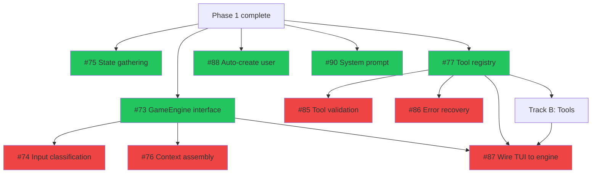
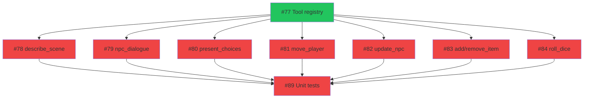
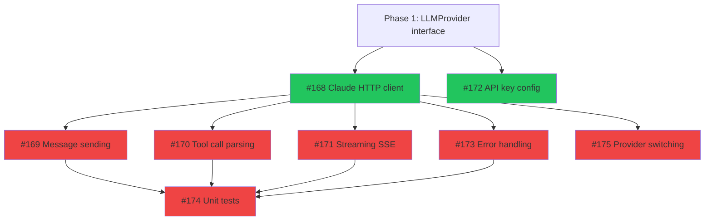

# Phase 2: Core Gameplay Loop

> 26 issues across 3 tracks. **7 ready** (when Phase 1 completes), 19 blocked by internal dependencies.
> Updated: 2026-03-21

## Summary

| Track | Name              | Total  | Ready | Blocked | Epic | Models            |
| ----- | ----------------- | :----: | :---: | :-----: | ---- | ----------------- |
| A     | Engine & Pipeline |   10   |   5   |    5    | #6   | Mixed (Opus-heavy) |
| B     | Tools             |   8    |   0   |    8    | #6   | gpt-5.3-codex     |
| C     | Claude Provider   |   8    |   2   |    6    | #16  | Mixed             |
|       | **Total**         | **26** | **7** | **19**  |      |                   |

**Critical path:** Track A (#73, #77) → Track B (tools) → Track A (#87 wire TUI) → playable turn

**Phase entry criteria:** Phase 1 complete (database, LLM provider, TUI shell all working).

**Phase exit criteria:** A player can type input in the TUI, the LLM responds with narrative + tool calls, state changes are applied, and the response streams to the viewport. Claude API provider working as an alternative to Ollama.

---

## Track A: Engine & Pipeline

> The turn pipeline orchestration layer. Connects database, LLM, tools, and TUI.
> Depends on: Phase 1 (Tracks B+C+D, E, F all complete)

| #   | Issue                                                          | Title                                     | Size | Blocker           | Status  | Model             | Notes                       |
| --- | -------------------------------------------------------------- | ----------------------------------------- | :--: | ----------------- | ------- | ----------------- | --------------------------- |
| 1   | [#73](https://git.subcult.tv/subculture-collective/edda/issues/73) | Define GameEngine interface               |  S   | Phase 1           | READY   | Claude Opus 4.6   | Do first                    |
| 2   | [#90](https://git.subcult.tv/subculture-collective/edda/issues/90) | Write system prompt for game master LLM   |  M   | None              | READY   | Claude Opus 4.6   | Creative work, no code deps |
| 3   | [#75](https://git.subcult.tv/subculture-collective/edda/issues/75) | Implement state gathering from Postgres   |  M   | Phase 1           | READY   | gpt-5.3-codex     | Needs sqlc queries          |
| 4   | [#76](https://git.subcult.tv/subculture-collective/edda/issues/76) | Implement LLM context assembly            |  M   | #73               | BLOCKED | Claude Sonnet 4.6 |                             |
| 5   | [#77](https://git.subcult.tv/subculture-collective/edda/issues/77) | Implement tool registry and registration  |  S   | Phase 1           | READY   | Claude Sonnet 4.6 | Unblocks all tools          |
| 6   | [#74](https://git.subcult.tv/subculture-collective/edda/issues/74) | Implement input classification            |  S   | #73               | BLOCKED | gpt-5.3-codex     |                             |
| 7   | [#85](https://git.subcult.tv/subculture-collective/edda/issues/85) | Implement tool call validation + post-hoc |  M   | #77               | BLOCKED | Claude Sonnet 4.6 |                             |
| 8   | [#86](https://git.subcult.tv/subculture-collective/edda/issues/86) | Implement error recovery: retry then skip |  S   | #77               | BLOCKED | Claude Sonnet 4.6 |                             |
| 9   | [#88](https://git.subcult.tv/subculture-collective/edda/issues/88) | Auto-create default user and campaign     |  S   | Phase 1           | READY   | gpt-5.4 mini      |                             |
| 10  | [#87](https://git.subcult.tv/subculture-collective/edda/issues/87) | Wire TUI input to game engine             |  L   | #73, #77, Track B | BLOCKED | Claude Opus 4.6   | THE integration point       |



**Parallelizable:** #73, #75, #77, #88, #90 all start simultaneously. After #73: #74 and #76. After #77: #85, #86, and all Track B tools.

---

## Track B: Tools

> LLM tool handlers. All depend on the tool registry (#77).
> Depends on: Track A (#77 tool registry)

| #   | Issue                                                          | Title                                    | Size | Blocker  | Status  | Model         | Notes                 |
| --- | -------------------------------------------------------------- | ---------------------------------------- | :--: | -------- | ------- | ------------- | --------------------- |
| 1   | [#78](https://git.subcult.tv/subculture-collective/edda/issues/78) | Implement describe_scene tool            |  S   | #77      | BLOCKED | gpt-5.3-codex |                       |
| 2   | [#79](https://git.subcult.tv/subculture-collective/edda/issues/79) | Implement npc_dialogue tool              |  S   | #77      | BLOCKED | gpt-5.3-codex |                       |
| 3   | [#80](https://git.subcult.tv/subculture-collective/edda/issues/80) | Implement present_choices tool           |  S   | #77      | BLOCKED | gpt-5.3-codex | No DB needed          |
| 4   | [#81](https://git.subcult.tv/subculture-collective/edda/issues/81) | Implement move_player tool               |  S   | #77      | BLOCKED | gpt-5.3-codex |                       |
| 5   | [#82](https://git.subcult.tv/subculture-collective/edda/issues/82) | Implement update_npc tool                |  S   | #77      | BLOCKED | gpt-5.3-codex |                       |
| 6   | [#83](https://git.subcult.tv/subculture-collective/edda/issues/83) | Implement add_item and remove_item tools |  S   | #77      | BLOCKED | gpt-5.3-codex |                       |
| 7   | [#84](https://git.subcult.tv/subculture-collective/edda/issues/84) | Implement roll_dice tool                 |  S   | #77      | BLOCKED | gpt-5.3-codex | No DB needed          |
| 8   | [#89](https://git.subcult.tv/subculture-collective/edda/issues/89) | Unit tests: turn pipeline orchestration  |  L   | #73, #77 | BLOCKED | gpt-5.3-codex | Tests entire pipeline |



**Parallelizable:** All 7 tools (#78-#84) can be built simultaneously once #77 is done. This is the most parallelizable track in the project.

---

## Track C: Claude Provider

> Second LLM provider implementation. Runs independently from Tracks A-B.
> Depends on: Phase 1 Track E (#56 LLMProvider interface)

| #   | Issue                                                            | Title                                       | Size | Blocker   | Status  | Model             | Notes               |
| --- | ---------------------------------------------------------------- | ------------------------------------------- | :--: | --------- | ------- | ----------------- | ------------------- |
| 1   | [#168](https://git.subcult.tv/subculture-collective/edda/issues/168) | Implement Claude HTTP client                |  M   | Phase 1   | READY   | gpt-5.3-codex     |                     |
| 2   | [#172](https://git.subcult.tv/subculture-collective/edda/issues/172) | Implement Claude API key configuration      |  S   | Phase 1   | READY   | gpt-5.4 mini      | Can start with #168 |
| 3   | [#169](https://git.subcult.tv/subculture-collective/edda/issues/169) | Implement Claude message sending with tools |  M   | #168      | BLOCKED | gpt-5.3-codex     |                     |
| 4   | [#170](https://git.subcult.tv/subculture-collective/edda/issues/170) | Implement Claude tool call parsing          |  S   | #168      | BLOCKED | gpt-5.3-codex     |                     |
| 5   | [#171](https://git.subcult.tv/subculture-collective/edda/issues/171) | Implement Claude streaming support          |  M   | #168      | BLOCKED | Claude Sonnet 4.6 | SSE parsing         |
| 6   | [#173](https://git.subcult.tv/subculture-collective/edda/issues/173) | Implement Claude error handling             |  S   | #168      | BLOCKED | gpt-5.3-codex     |                     |
| 7   | [#174](https://git.subcult.tv/subculture-collective/edda/issues/174) | Unit tests: Claude provider with fixtures   |  M   | #168-#173 | BLOCKED | gpt-5.3-codex     |                     |
| 8   | [#175](https://git.subcult.tv/subculture-collective/edda/issues/175) | Implement provider switching via config     |  S   | #168      | BLOCKED | gpt-5.3-codex     |                     |



**Parallelizable:** #168 and #172 start together. After #168: #169, #170, #171, #173, #175 all in parallel.

**Note:** Track C is fully independent from Tracks A-B. It can run in parallel with the entire turn pipeline implementation.

---

## Phase 2 Execution Order

```
Week 1:  Track A foundations + Track C start (in parallel)
         ├── Track A: #73 (GameEngine), #75 (state gather), #77 (tool registry),
         │            #88 (auto-create user), #90 (system prompt) — all parallel
         └── Track C: #168 (Claude HTTP client), #172 (API key config) — parallel

Week 2:  Track A continued + Track B (all tools) + Track C continued
         ├── Track A: #74, #76, #85, #86 — after their deps resolve
         ├── Track B: #78-#84 all 7 tools in parallel (after #77)
         └── Track C: #169-#171, #173, #175 all in parallel (after #168)

Week 3:  Integration + Tests
         ├── Track A: #87 (Wire TUI to engine) — THE moment it all connects
         ├── Track B: #89 (pipeline unit tests)
         └── Track C: #174 (Claude unit tests)
         └── Gate: type in TUI → LLM responds → state changes → narrative streams
```

**Phase 2 → Phase 3 handoff:** The turn pipeline (Epic #6) must be complete. Track C (Claude) is nice-to-have but not blocking. Phase 3 tracks all depend on Epic #6 being done.
