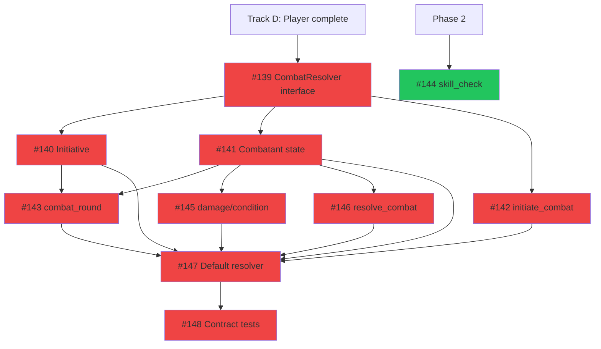
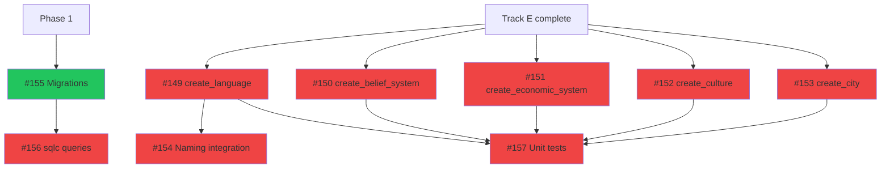
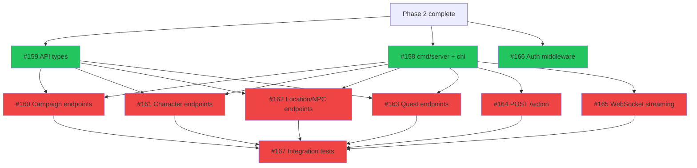
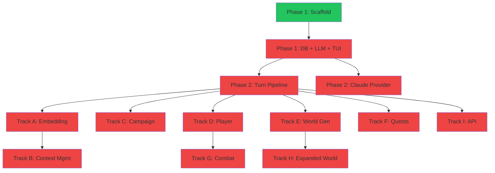

# Phase 3: Game Systems & API

> 77 issues across 9 tracks. **39 ready** (when Phase 2 completes), 38 blocked by internal dependencies.
> Updated: 2026-03-21

## Summary

| Track | Name               | Total  | Ready  | Blocked | Epic | Parallel group | Models              |
| ----- | ------------------ | :----: | :----: | :-----: | ---- | -------------- | ------------------- |
| A     | Embedding & Memory |   7    |   4    |    3    | #7   | Alpha          | Mixed               |
| B     | Context Management |   8    |   0    |    8    | #8   | Beta (after A) | Mixed (Opus-heavy)  |
| C     | Campaign Creation  |   7    |   4    |    3    | #9   | Alpha          | Claude Opus 4.6     |
| D     | Player Character   |   9    |   6    |    3    | #10  | Alpha          | Mixed               |
| E     | World Generation   |   9    |   6    |    3    | #11  | Alpha          | gpt-5.3-codex       |
| F     | Quest System       |   8    |   6    |    2    | #12  | Alpha          | gpt-5.3-codex       |
| G     | Combat             |   10   |   2    |    8    | #13  | Beta (after D) | Claude Opus 4.6     |
| H     | Expanded World     |   9    |   5    |    4    | #14  | Beta (after E) | gpt-5.3-codex       |
| I     | REST API           |   10   |   5    |    5    | #15  | Alpha          | Mixed               |
|       | **Total**          | **77** | **38** | **39**  |      |                |                     |

**Parallel groups:**

- **Alpha** (Tracks A, C, D, E, F, I): All can start immediately when Phase 2 completes. Six independent tracks running simultaneously.
- **Beta** (Tracks B, G, H): Blocked by Alpha tracks. Track B needs Track A. Track G needs Track D. Track H needs Track E.

**Phase entry criteria:** Phase 2 complete (turn pipeline working, player can type and get LLM responses).

**Phase exit criteria:** All game systems implemented. Embedding + semantic memory working. Campaign creation, player management, world generation, quests, combat all functional. REST API serving game state. Expanded worldbuilding tools available.

---

## Track G: Combat

> Structured narrative combat system behind pluggable interface.
> Depends on: Track D (Player Character — needs stats/HP)

| #   | Issue                                                            | Title                                        | Size | Blocker    | Status  | Model             | Notes                         |
| --- | ---------------------------------------------------------------- | -------------------------------------------- | :--: | ---------- | ------- | ----------------- | ----------------------------- |
| 1   | [#139](https://git.subcult.tv/subculture-collective/edda/issues/139) | Define CombatResolver interface              |  M   | Track D    | BLOCKED | Claude Opus 4.6   |                               |
| 2   | [#144](https://git.subcult.tv/subculture-collective/edda/issues/144) | Implement skill_check tool                   |  S   | Phase 2    | READY   | gpt-5.3-codex     | Pure logic, no track dep      |
| 3   | [#140](https://git.subcult.tv/subculture-collective/edda/issues/140) | Implement initiative ordering system         |  M   | #139       | BLOCKED | gpt-5.3-codex     |                               |
| 4   | [#141](https://git.subcult.tv/subculture-collective/edda/issues/141) | Implement combatant state management         |  M   | #139       | BLOCKED | Claude Sonnet 4.6 |                               |
| 5   | [#142](https://git.subcult.tv/subculture-collective/edda/issues/142) | Implement initiate_combat tool               |  M   | #139       | BLOCKED | gpt-5.3-codex     |                               |
| 6   | [#143](https://git.subcult.tv/subculture-collective/edda/issues/143) | Implement combat_round tool                  |  L   | #140, #141 | BLOCKED | Claude Opus 4.6   |                               |
| 7   | [#145](https://git.subcult.tv/subculture-collective/edda/issues/145) | Implement apply_damage/apply_condition tools |  M   | #141       | BLOCKED | gpt-5.3-codex     |                               |
| 8   | [#146](https://git.subcult.tv/subculture-collective/edda/issues/146) | Implement resolve_combat tool                |  M   | #141       | BLOCKED | Claude Sonnet 4.6 |                               |
| 9   | [#147](https://git.subcult.tv/subculture-collective/edda/issues/147) | Implement default narrative CombatResolver   |  L   | #140-#146  | BLOCKED | Claude Opus 4.6   | Ties everything together      |
| 10  | [#148](https://git.subcult.tv/subculture-collective/edda/issues/148) | Interface contract tests for CombatResolver  |  L   | #147       | BLOCKED | Claude Opus 4.6   | Reusable for future rule sets |



**Parallelizable after #139:** #140, #141, #142 in parallel. After #141: #143, #145, #146 in parallel.

---

## Track H: Expanded World Generation

> Deep worldbuilding tools: languages, belief systems, economies, cultures, cities.
> Depends on: Track E (World Generation — core entity tools)

| #   | Issue                                                            | Title                                       | Size | Blocker   | Status  | Model             | Notes                   |
| --- | ---------------------------------------------------------------- | ------------------------------------------- | :--: | --------- | ------- | ----------------- | ----------------------- |
| 1   | [#155](https://git.subcult.tv/subculture-collective/edda/issues/155) | Migration: create expanded world tables     |  S   | Phase 1   | READY   | gpt-5.3-codex     | Can start early         |
| 2   | [#156](https://git.subcult.tv/subculture-collective/edda/issues/156) | sqlc queries: expanded world tables         |  S   | #155      | BLOCKED | gpt-5.3-codex     |                         |
| 3   | [#149](https://git.subcult.tv/subculture-collective/edda/issues/149) | Implement create_language tool              |  M   | Track E   | BLOCKED | gpt-5.3-codex     |                         |
| 4   | [#150](https://git.subcult.tv/subculture-collective/edda/issues/150) | Implement create_belief_system tool         |  M   | Track E   | BLOCKED | gpt-5.3-codex     |                         |
| 5   | [#151](https://git.subcult.tv/subculture-collective/edda/issues/151) | Implement create_economic_system tool       |  M   | Track E   | BLOCKED | gpt-5.3-codex     |                         |
| 6   | [#152](https://git.subcult.tv/subculture-collective/edda/issues/152) | Implement create_culture tool               |  M   | Track E   | BLOCKED | gpt-5.3-codex     |                         |
| 7   | [#153](https://git.subcult.tv/subculture-collective/edda/issues/153) | Implement create_city tool                  |  M   | Track E   | BLOCKED | gpt-5.3-codex     |                         |
| 8   | [#154](https://git.subcult.tv/subculture-collective/edda/issues/154) | Implement language naming integration       |  M   | #149      | BLOCKED | Claude Sonnet 4.6 | Uses language phonology |
| 9   | [#157](https://git.subcult.tv/subculture-collective/edda/issues/157) | Unit tests: expanded world generation tools |  L   | #149-#153 | BLOCKED | gpt-5.3-codex     |                         |



**Note:** #155 and #156 (migrations + queries) can start in Phase 1 or Phase 2 since they only need the database. Start them early to avoid blocking the tools.

**Parallelizable after Track E:** #149-#153 all in parallel.

---

## Track I: REST API

> HTTP API wrapping the game engine for future web/mobile clients.
> Depends on: Phase 2 (Epic #6 turn pipeline)

| #   | Issue                                                            | Title                                       | Size | Blocker    | Status  | Model             | Notes                  |
| --- | ---------------------------------------------------------------- | ------------------------------------------- | :--: | ---------- | ------- | ----------------- | ---------------------- |
| 1   | [#159](https://git.subcult.tv/subculture-collective/edda/issues/159) | Define shared API types in pkg/api          |  M   | Phase 2    | READY   | gpt-5.3-codex     |                        |
| 2   | [#158](https://git.subcult.tv/subculture-collective/edda/issues/158) | Create cmd/server entry point + chi router  |  M   | Phase 2    | READY   | gpt-5.3-codex     |                        |
| 3   | [#166](https://git.subcult.tv/subculture-collective/edda/issues/166) | Implement auth middleware interface (no-op) |  S   | Phase 2    | READY   | gpt-5.3-codex     |                        |
| 4   | [#160](https://git.subcult.tv/subculture-collective/edda/issues/160) | Implement campaign REST endpoints           |  M   | #158, #159 | BLOCKED | gpt-5.3-codex     |                        |
| 5   | [#161](https://git.subcult.tv/subculture-collective/edda/issues/161) | Implement character REST endpoints          |  S   | #158, #159 | BLOCKED | gpt-5.3-codex     |                        |
| 6   | [#162](https://git.subcult.tv/subculture-collective/edda/issues/162) | Implement location and NPC REST endpoints   |  M   | #158, #159 | BLOCKED | gpt-5.3-codex     |                        |
| 7   | [#163](https://git.subcult.tv/subculture-collective/edda/issues/163) | Implement quest REST endpoints              |  S   | #158, #159 | BLOCKED | gpt-5.3-codex     |                        |
| 8   | [#164](https://git.subcult.tv/subculture-collective/edda/issues/164) | Implement POST /action endpoint             |  M   | #158       | BLOCKED | Claude Sonnet 4.6 | Core gameplay endpoint |
| 9   | [#165](https://git.subcult.tv/subculture-collective/edda/issues/165) | Implement WebSocket streaming endpoint      |  L   | #158       | BLOCKED | Claude Sonnet 4.6 |                        |
| 10  | [#167](https://git.subcult.tv/subculture-collective/edda/issues/167) | HTTP integration tests for API              |  L   | #160-#165  | BLOCKED | Claude Sonnet 4.6 | testcontainers         |



**Parallelizable:** #158, #159, #166 start simultaneously. Then #160-#165 all in parallel.

---

## Phase 3 Execution Order

```
Sprint 1:  Alpha group — 6 tracks in parallel
           ├── Track A: Embedding (#91, #92, #94, #97 → #93, #95 → #96)
           ├── Track C: Campaign (#107, #111, #106, #108 → #109 → #110, #112)
           ├── Track D: Player (#113-#118 → #119, #120, #121)
           ├── Track E: World (#122-#127 → #128, #129, #130)
           ├── Track F: Quest (#131-#136 → #137, #138)
           └── Track I: API (#158, #159, #166 → #160-#165 → #167)
           Also: Track H #155, #156 (migrations — start early)

Sprint 2:  Beta group — 3 tracks unblocked by Alpha
           ├── Track B: Context Mgmt (#98-#103 → #101 → #104, #105)
           ├── Track G: Combat (#139 → #140-#142 → #143, #145, #146 → #147 → #148)
           └── Track H: Expanded World (#149-#153 → #154, #157)
           Gate: full game loop with memory, combat, deep worldbuilding, API
```

---

## Full Project Dependency Graph


