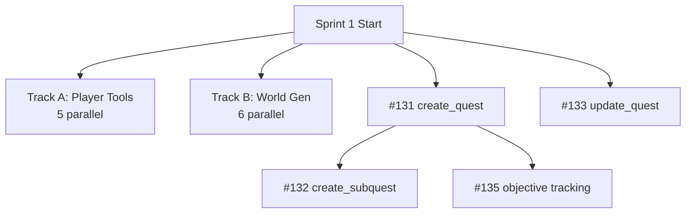
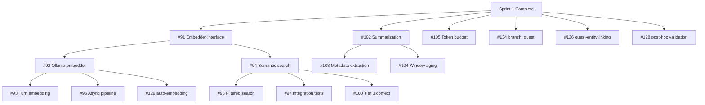
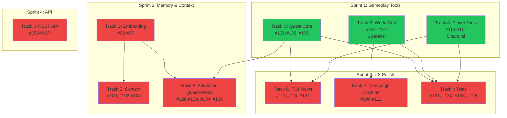

# Phase 4: Depth & Polish

> 62 remaining issues across 8 tracks. Reorganized from the original Phase 3 plan after Phase 2 completion and early Phase 3 combat/worldbuilding work.
> Updated: 2026-03-28

## What's Done

Phases 1-2 complete. From the original Phase 3, the following tracks are **finished**:

- **Combat** (Track G): NarrativeCombatResolver + 5 combat tools (#139-#147 closed)
- **Expanded World** (Track H): 6 worldbuilding tools + generate_name (#149-#157 closed)
- **Claude Provider** (Phase 2 Track C): Full implementation (#168-#175 closed)
- **Context Assembly** (Track B partial): Tier 1+2 + unified assembler (#98, #99, #101 closed)

## Phase Entry Criteria

Turn pipeline working end-to-end: player types input in TUI, LLM responds with narrative + tool calls, state changes persist, response streams to viewport. (**Met.**)

## Phase Exit Criteria

Full gameplay depth: LLM can create/modify all game entities during play. Semantic memory provides relevant context. Campaign creation is guided. TUI views show real data. REST API serves game state.

---

## Sprint 1: Gameplay Tools (LLM needs these to run the game)

> The LLM currently can narrate, move the player, manage NPCs, handle combat, and do worldbuilding — but it can't modify player stats, create world entities on the fly, or manage quests. These are the tools that make gameplay rich.

### Track A: Player Character Tools

> Tools for the LLM to modify the player during gameplay.
> Depends on: Nothing (all sqlc queries exist)

| #   | Issue                                                            | Title                                                   | Size | Blocker | Status | Model         | Notes                                   |
| --- | ---------------------------------------------------------------- | ------------------------------------------------------- | :--: | ------- | ------ | ------------- | --------------------------------------- |
| 1   | [#113](https://git.subcult.tv/subculture-collective/edda/issues/113) | Implement update_player_stats tool                      |  S   | None    | READY  | gpt-5.3-codex | UpdatePlayerStats query exists          |
| 2   | [#114](https://git.subcult.tv/subculture-collective/edda/issues/114) | Implement add_experience and level_up tools             |  M   | None    | READY  | gpt-5.3-codex | Two tools; level threshold logic needed |
| 3   | [#115](https://git.subcult.tv/subculture-collective/edda/issues/115) | Implement add_ability and remove_ability tools          |  S   | None    | READY  | gpt-5.3-codex | JSON array mutation on Abilities column |
| 4   | [#116](https://git.subcult.tv/subculture-collective/edda/issues/116) | Implement update_player_status tool                     |  S   | None    | READY  | gpt-5.3-codex | Simple status enum update               |
| 5   | [#117](https://git.subcult.tv/subculture-collective/edda/issues/117) | Implement enhanced item tools: modify_item, create_item |  S   | None    | READY  | gpt-5.3-codex | Extends existing item_tools.go pattern  |

**All 5 can run in parallel.** Follow existing tool handler pattern (see `internal/tools/doc.go`). Store interfaces use domain types; adapters in `game/`.

### Track B: World Generation Tools

> Tools for the LLM to create world entities during gameplay.
> Depends on: Nothing (all sqlc queries exist)

| #   | Issue                                                            | Title                                          | Size | Blocker | Status | Model             | Notes                                    |
| --- | ---------------------------------------------------------------- | ---------------------------------------------- | :--: | ------- | ------ | ----------------- | ---------------------------------------- |
| 1   | [#122](https://git.subcult.tv/subculture-collective/edda/issues/122) | Implement create_npc tool                      |  M   | None    | READY  | gpt-5.3-codex     | Rich schema: personality, stats, faction |
| 2   | [#123](https://git.subcult.tv/subculture-collective/edda/issues/123) | Implement create_location tool                 |  M   | None    | READY  | gpt-5.3-codex     | Connections + properties JSON            |
| 3   | [#124](https://git.subcult.tv/subculture-collective/edda/issues/124) | Implement create_faction tool                  |  M   | None    | READY  | gpt-5.3-codex     | Agenda, territory, NPC relationships     |
| 4   | [#125](https://git.subcult.tv/subculture-collective/edda/issues/125) | Implement create_lore tool                     |  S   | None    | READY  | gpt-5.3-codex     | WorldFact + optional memory embedding    |
| 5   | [#126](https://git.subcult.tv/subculture-collective/edda/issues/126) | Implement establish_fact and revise_fact tools |  M   | None    | READY  | Claude Sonnet 4.6 | Supersede logic needs careful state mgmt |
| 6   | [#127](https://git.subcult.tv/subculture-collective/edda/issues/127) | Implement establish_relationship tool          |  S   | None    | READY  | gpt-5.3-codex     | EntityRelationship with source/target    |

**All 6 can run in parallel.** These are the "just-in-time" creation tools — the LLM generates NPCs, locations, and lore as the player encounters them.

### Track C: Quest System Core

> Tools for the LLM to drive story structure through quests.
> Depends on: Nothing (all sqlc queries exist)

| #   | Issue                                                            | Title                              | Size | Blocker | Status  | Model             | Notes                                   |
| --- | ---------------------------------------------------------------- | ---------------------------------- | :--: | ------- | ------- | ----------------- | --------------------------------------- |
| 1   | [#131](https://git.subcult.tv/subculture-collective/edda/issues/131) | Implement create_quest tool        |  M   | None    | READY   | Claude Sonnet 4.6 | Short/medium/long-term type system      |
| 2   | [#132](https://git.subcult.tv/subculture-collective/edda/issues/132) | Implement create_subquest tool     |  S   | #131    | BLOCKED | gpt-5.3-codex     | Parent quest validation                 |
| 3   | [#133](https://git.subcult.tv/subculture-collective/edda/issues/133) | Implement update_quest tool        |  S   | None    | READY   | gpt-5.3-codex     | Status transitions + validation         |
| 4   | [#135](https://git.subcult.tv/subculture-collective/edda/issues/135) | Implement quest objective tracking |  M   | #131    | BLOCKED | Claude Sonnet 4.6 | Ordered objectives, completion tracking |

**#131 and #133 can start immediately. After #131: #132 and #135 in parallel.**

**Sprint 1 total: 15 issues, all tool implementations. Maximum parallelism.**

---

## Sprint 2: Memory & Context (LLM gets smarter over time)

> The LLM currently has a 10-turn sliding window and full game state. This sprint adds semantic memory (recall relevant past events) and summarization (compress old turns).

### Track D: Embedding Pipeline

> Semantic memory infrastructure. Unlocks Tier 3 context and auto-embedding.
> Depends on: Nothing (pgvector schema already exists)

| #   | Issue                                                          | Title                                             | Size | Blocker | Status  | Model             | Notes                                     |
| --- | -------------------------------------------------------------- | ------------------------------------------------- | :--: | ------- | ------- | ----------------- | ----------------------------------------- |
| 1   | [#91](https://git.subcult.tv/subculture-collective/edda/issues/91) | Define Embedder interface and types               |  S   | None    | READY   | Claude Opus 4.6   | Architecture decision; provider-agnostic  |
| 2   | [#92](https://git.subcult.tv/subculture-collective/edda/issues/92) | Implement Ollama embedding provider               |  M   | #91     | BLOCKED | gpt-5.3-codex     | HTTP client mirrors llm/ollama.go pattern |
| 3   | [#93](https://git.subcult.tv/subculture-collective/edda/issues/93) | Implement turn event embedding and storage        |  M   | #92     | BLOCKED | Claude Sonnet 4.6 | Integration: turn pipeline → pgvector     |
| 4   | [#94](https://git.subcult.tv/subculture-collective/edda/issues/94) | Implement semantic search by similarity           |  M   | #91     | BLOCKED | gpt-5.3-codex     | pgvector cosine similarity query          |
| 5   | [#95](https://git.subcult.tv/subculture-collective/edda/issues/95) | Implement metadata-filtered semantic search       |  M   | #94     | BLOCKED | gpt-5.3-codex     | JSON filter + vector search combo         |
| 6   | [#96](https://git.subcult.tv/subculture-collective/edda/issues/96) | Implement async embedding pipeline                |  L   | #92     | BLOCKED | Claude Opus 4.6   | Goroutine design, backpressure, shutdown  |
| 7   | [#97](https://git.subcult.tv/subculture-collective/edda/issues/97) | Integration tests: pgvector storage and retrieval |  L   | #94     | BLOCKED | Claude Sonnet 4.6 | testcontainers with pgvector              |

**#91 first, then #92 and #94 in parallel. After #92: #93, #96. After #94: #95, #97.**

### Track E: Context Management

> Better LLM context: semantic retrieval, summarization, token budgets.
> Depends on: Track D (#91, #94 for semantic search)

| #   | Issue                                                            | Title                                            | Size | Blocker     | Status  | Model             | Notes                                       |
| --- | ---------------------------------------------------------------- | ------------------------------------------------ | :--: | ----------- | ------- | ----------------- | ------------------------------------------- |
| 1   | [#100](https://git.subcult.tv/subculture-collective/edda/issues/100) | Implement Tier 3 context: semantic retrieval     |  M   | Track D #94 | BLOCKED | Claude Sonnet 4.6 | Wire pgvector search into assembler         |
| 2   | [#102](https://git.subcult.tv/subculture-collective/edda/issues/102) | Implement turn summarization via LLM             |  M   | None        | READY   | Claude Opus 4.6   | LLM-as-judge: prompt design for summaries   |
| 3   | [#103](https://git.subcult.tv/subculture-collective/edda/issues/103) | Implement rich metadata extraction for summaries |  M   | #102        | BLOCKED | Claude Sonnet 4.6 | Time, location, NPCs, type from summaries   |
| 4   | [#104](https://git.subcult.tv/subculture-collective/edda/issues/104) | Implement sliding window aging and summarization |  M   | #102        | BLOCKED | Claude Sonnet 4.6 | Trigger policy: when to summarize old turns |
| 5   | [#105](https://git.subcult.tv/subculture-collective/edda/issues/105) | Implement token budget awareness                 |  M   | None        | READY   | GPT-4             | Token counting + dynamic context sizing     |

**#102 and #105 can start immediately.** #100 waits for Track D's semantic search. After #102: #103 and #104 in parallel.

### Track F: Advanced Quest + World

> Quest branching, entity linking, validation, auto-embedding.
> Depends on: Sprint 1 (Track C quest tools), Track D (for auto-embedding)

| #   | Issue                                                            | Title                                           | Size | Blocker          | Status  | Model             | Notes                                   |
| --- | ---------------------------------------------------------------- | ----------------------------------------------- | :--: | ---------------- | ------- | ----------------- | --------------------------------------- |
| 1   | [#134](https://git.subcult.tv/subculture-collective/edda/issues/134) | Implement branch_quest tool                     |  M   | Sprint 1 #131    | BLOCKED | Claude Sonnet 4.6 | Quest graph logic, parent-child linking |
| 2   | [#136](https://git.subcult.tv/subculture-collective/edda/issues/136) | Implement quest-entity linking                  |  M   | Sprint 1 #131    | BLOCKED | gpt-5.3-codex     | EntityRelationship for quest → NPC/loc  |
| 3   | [#128](https://git.subcult.tv/subculture-collective/edda/issues/128) | Implement post-hoc entity validation            |  M   | Sprint 1 Track B | BLOCKED | Claude Sonnet 4.6 | Referential integrity after LLM creates |
| 4   | [#129](https://git.subcult.tv/subculture-collective/edda/issues/129) | Implement auto-embedding for generated entities |  M   | Track D #92      | BLOCKED | gpt-5.3-codex     | Hook into existing world service        |

**Sprint 2 total: 18 issues. Track D is the critical path.**

---

## Sprint 3: User Experience (polish the TUI, guided creation)

> Replace placeholder views with real data. Add structured campaign creation.

### Track G: TUI Views

> Fill in the placeholder character sheet, inventory, and quest views.
> Depends on: Sprint 1 (player + quest tools provide the data)

| #   | Issue                                                            | Title                                            | Size | Blocker          | Status  | Model             | Notes                                   |
| --- | ---------------------------------------------------------------- | ------------------------------------------------ | :--: | ---------------- | ------- | ----------------- | --------------------------------------- |
| 1   | [#118](https://git.subcult.tv/subculture-collective/edda/issues/118) | Build character sheet TUI view                   |  M   | Sprint 1 Track A | BLOCKED | Claude Sonnet 4.6 | Lip Gloss layout, stat rendering        |
| 2   | [#119](https://git.subcult.tv/subculture-collective/edda/issues/119) | Build inventory TUI view                         |  M   | Sprint 1 Track A | BLOCKED | Claude Sonnet 4.6 | List model, equipped indicators         |
| 3   | [#137](https://git.subcult.tv/subculture-collective/edda/issues/137) | Build quest log TUI view                         |  M   | Sprint 1 Track C | BLOCKED | Claude Sonnet 4.6 | Tree display for quest → objectives     |
| 4   | [#120](https://git.subcult.tv/subculture-collective/edda/issues/120) | Implement real-time view updates on state change |  L   | #118, #119, #137 | BLOCKED | Claude Opus 4.6   | Bubble Tea message bus, cross-view sync |

**#118, #119, #137 in parallel. Then #120 once all views exist.**

### Track H: Campaign Creation

> Guided campaign + character creation using LLM interviews and Huh forms.
> Depends on: Sprint 1 Track B (world gen tools for skeleton generation)

| #   | Issue                                                            | Title                                              | Size | Blocker          | Status  | Model             | Notes                                     |
| --- | ---------------------------------------------------------------- | -------------------------------------------------- | :--: | ---------------- | ------- | ----------------- | ----------------------------------------- |
| 1   | [#106](https://git.subcult.tv/subculture-collective/edda/issues/106) | Implement campaign creation LLM interview flow     |  L   | None             | READY   | Claude Opus 4.6   | Prompt design + multi-turn LLM interview  |
| 2   | [#107](https://git.subcult.tv/subculture-collective/edda/issues/107) | Implement Huh forms for structured campaign inputs |  M   | #106             | BLOCKED | Claude Sonnet 4.6 | Huh library integration, form schema      |
| 3   | [#108](https://git.subcult.tv/subculture-collective/edda/issues/108) | Implement character creation interview             |  L   | #106             | BLOCKED | Claude Opus 4.6   | LLM-guided character backstory + stats    |
| 4   | [#109](https://git.subcult.tv/subculture-collective/edda/issues/109) | Implement world skeleton generation                |  L   | Sprint 1 Track B | BLOCKED | Claude Opus 4.6   | Uses world gen tools to build initial map |
| 5   | [#110](https://git.subcult.tv/subculture-collective/edda/issues/110) | Implement starting scene generation                |  M   | #109             | BLOCKED | Claude Sonnet 4.6 | First narration from generated world      |
| 6   | [#111](https://git.subcult.tv/subculture-collective/edda/issues/111) | Implement campaign selection screen                |  M   | None             | READY   | gpt-5.3-codex     | Bubble Tea list model, DB query           |
| 7   | [#112](https://git.subcult.tv/subculture-collective/edda/issues/112) | Implement campaign resume and state restoration    |  M   | #111             | BLOCKED | Claude Sonnet 4.6 | Restore state + generate re-entry scene   |

**#106 and #111 start immediately.** #109 waits for world gen tools.

### Track I: Tests

> Unit and contract tests for all Sprint 1-2 work.

| #   | Issue                                                            | Title                                            | Size | Blocker          | Status  | Model           | Notes                                    |
| --- | ---------------------------------------------------------------- | ------------------------------------------------ | :--: | ---------------- | ------- | --------------- | ---------------------------------------- |
| 1   | [#121](https://git.subcult.tv/subculture-collective/edda/issues/121) | Unit tests: player character and inventory tools |  L   | Sprint 1 Track A | BLOCKED | gpt-5.3-codex   | Stub stores, edge cases                  |
| 2   | [#130](https://git.subcult.tv/subculture-collective/edda/issues/130) | Unit tests: world generation tools               |  L   | Sprint 1 Track B | BLOCKED | gpt-5.3-codex   | Follow create_language_test.go pattern   |
| 3   | [#138](https://git.subcult.tv/subculture-collective/edda/issues/138) | Unit tests: quest system tools                   |  L   | Sprint 1 Track C | BLOCKED | gpt-5.3-codex   | Quest state transitions, objective logic |
| 4   | [#148](https://git.subcult.tv/subculture-collective/edda/issues/148) | Interface contract tests for CombatResolver      |  L   | None             | READY   | Claude Opus 4.6 | Reusable for future rule sets            |

**Sprint 3 total: 15 issues. TUI views and campaign creation are the big UX wins.**

---

## Sprint 4: API Layer (multiplayer foundation)

> REST API + WebSocket streaming for future web/mobile clients.
> Depends on: Sprint 1 (needs working game engine for endpoints)

### Track J: REST API

| #   | Issue                                                            | Title                                        | Size | Blocker   | Status  | Model             | Notes                                |
| --- | ---------------------------------------------------------------- | -------------------------------------------- | :--: | --------- | ------- | ----------------- | ------------------------------------ |
| 1   | [#158](https://git.subcult.tv/subculture-collective/edda/issues/158) | Create cmd/server entry point and chi router |  M   | None      | READY   | gpt-5.3-codex     | chi/v5 boilerplate                   |
| 2   | [#166](https://git.subcult.tv/subculture-collective/edda/issues/166) | Implement auth middleware interface (no-op)  |  S   | None      | READY   | gpt-5.3-codex     | Passthrough now, implement for multi |
| 3   | [#160](https://git.subcult.tv/subculture-collective/edda/issues/160) | Implement campaign REST endpoints            |  M   | #158      | BLOCKED | gpt-5.3-codex     | CRUD via StateManager                |
| 4   | [#161](https://git.subcult.tv/subculture-collective/edda/issues/161) | Implement character REST endpoints           |  S   | #158      | BLOCKED | gpt-5.3-codex     | Read-only initially                  |
| 5   | [#162](https://git.subcult.tv/subculture-collective/edda/issues/162) | Implement location and NPC REST endpoints    |  M   | #158      | BLOCKED | gpt-5.3-codex     | Location graph + NPC list            |
| 6   | [#163](https://git.subcult.tv/subculture-collective/edda/issues/163) | Implement quest REST endpoints               |  S   | #158      | BLOCKED | gpt-5.3-codex     | Quest tree with objectives           |
| 7   | [#164](https://git.subcult.tv/subculture-collective/edda/issues/164) | Implement POST /action endpoint              |  M   | #158      | BLOCKED | Claude Sonnet 4.6 | Core gameplay endpoint, calls engine |
| 8   | [#165](https://git.subcult.tv/subculture-collective/edda/issues/165) | Implement WebSocket streaming endpoint       |  L   | #158      | BLOCKED | Claude Opus 4.6   | SSE/WS upgrade, chunk streaming      |
| 9   | [#167](https://git.subcult.tv/subculture-collective/edda/issues/167) | HTTP integration tests                       |  L   | #160-#165 | BLOCKED | Claude Sonnet 4.6 | testcontainers + httptest            |

**#158 and #166 start in parallel. After #158: #160-#165 all in parallel. #167 last.**

**Sprint 4 total: 9 issues.**

---

## Remaining Epics

| Epic | Title                                          | Status       | Remaining Issues |
| ---- | ---------------------------------------------- | ------------ | ---------------- |
| #7   | Embedding pipeline + semantic memory           | Sprint 2     | #91-#97          |
| #8   | Context window management + turn summarization | Sprint 2     | #100, #102-#105  |
| #9   | Collaborative campaign creation                | Sprint 3     | #106-#112        |
| #10  | Player character management + inventory        | Sprint 1+3   | #113-#121        |
| #11  | World generation tools                         | Sprint 1+2   | #122-#130        |
| #12  | Quest system                                   | Sprint 1+2+3 | #131-#138        |
| #15  | REST API + WebSocket streaming                 | Sprint 4     | #158-#167        |

---

## Model Selection Guide

| Model                 | Best For                                                                                       | Used In                                                                                        |
| --------------------- | ---------------------------------------------------------------------------------------------- | ---------------------------------------------------------------------------------------------- |
| **Claude Opus 4.6**   | Architecture decisions, creative prompt design, complex integration points, concurrency design | #91, #96, #102, #106, #108, #109, #120, #148, #165                                             |
| **Claude Sonnet 4.6** | Moderate complexity code, state management, middleware, context-aware wiring, TUI views        | #100, #103, #104, #107, #110, #112, #118, #119, #126, #128, #131, #134, #135, #137, #164, #167 |
| **gpt-5.3-codex**     | Mechanical tool implementations following established patterns, CRUD endpoints, unit tests     | #113-#117, #121-#125, #127, #129, #130, #132, #133, #136, #138, #158, #160-#163, #166          |
| **GPT-4**             | Analysis tasks, token counting algorithms, specification review                                | #105                                                                                           |

---

## Full Dependency Graph

**Green = ready now. Red = blocked by earlier sprints.**

---

## Summary

| Sprint    | Focus            | Issues | Ready  | Blocked |
| --------- | ---------------- | :----: | :----: | :-----: |
| 1         | Gameplay Tools   |   15   | **15** |    0    |
| 2         | Memory & Context |   18   |   3    |   15    |
| 3         | UX Polish        |   15   |   3    |   12    |
| 4         | API Layer        |   9    |   2    |    7    |
| **Total** |                  | **57** | **23** | **34**  |

**Critical path:** Sprint 1 (all tools) → Sprint 2 Track D (embedding) → Sprint 2 Track E (#100 semantic retrieval) → Sprint 3 (TUI views + campaign creation)

**Maximum parallelism in Sprint 1:** All 15 tool issues can be built simultaneously — they share the same pattern and have zero interdependencies (except #132 and #135 depending on #131).
